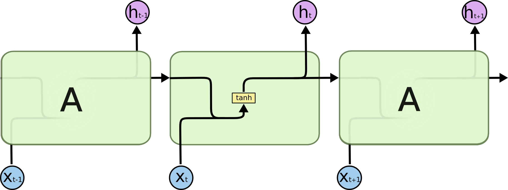
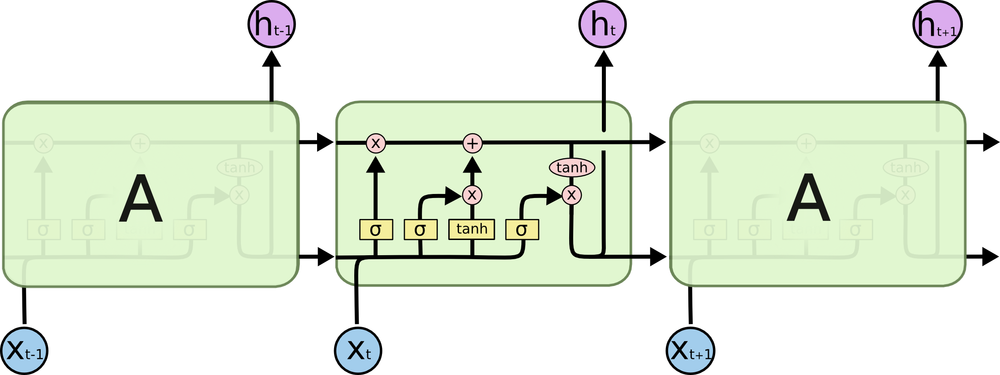
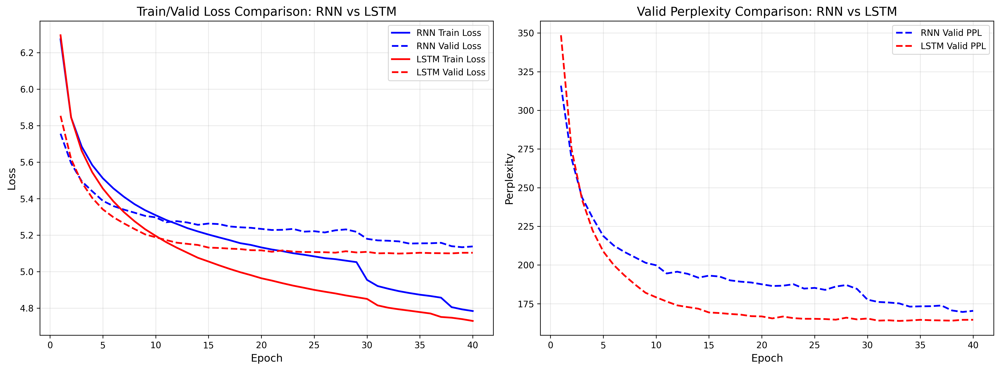
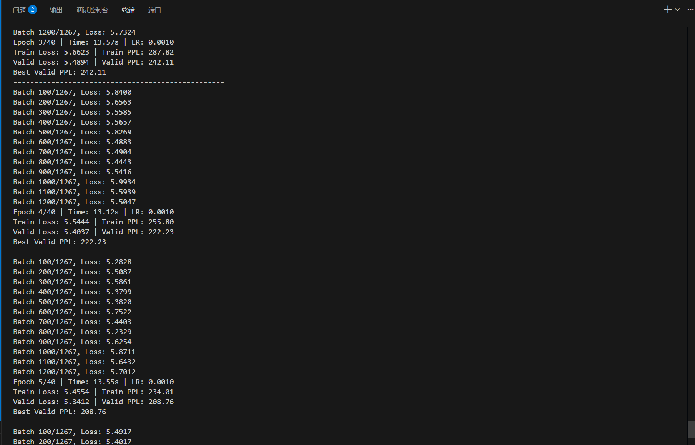
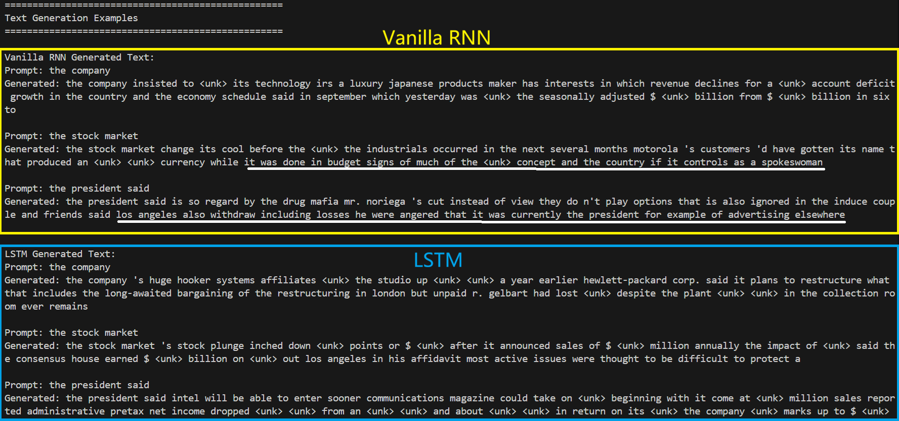

# 学习笔记，运行结果与讨论总结

## 一：学习笔记

### 1.什么是RNN/LSTM

RNN全称循环卷积网络，LSTM全称长短期记忆网络，RNN对于输入的序列，依次对输入的每一个序列元素进行非线性变换，并将输出加入到下一个序列元素的变换中，实现了对整个序列的记忆，并且每一个step的输出都是基于以前的序列，达到了“记忆”的目的，LSTM是RNN 的升级版，弥补了RNN在处理长序列容易忘记早期序列的缺点，他通过三门结构控制忘记量，记忆量和输出量更好的捕捉语义关系

### 2.RNN/LSTM数学公式要点

RNN：
$$
\begin{split}
&h_t = tanh(W_{xh} \cdot x_t + W_{hh} \cdot h_{t-1} + b_h)\\
&y_t = softmax(W_{hy} \cdot h_t + b_y)\\
&x_t:t时刻下的输入\\
&h_t:t时刻的隐藏状态\\
&W_{xh}: 输入到隐藏层的权重矩阵\\
&W_{hh}: 隐藏层到隐藏层的权重矩阵\\
&W_{hy}: 隐藏层到输出层的权重矩阵\\
&b_h, b_y: 偏置项
\end{split}
$$

LSTM:
$$
\begin{split}
&遗忘门：f_t = \sigma(W_f \cdot [h_{t-1}, x_t] + b_f)\\
&输入门：i_t=\sigma(W_i \cdot [h_{t-1}, x_t] + b_i)\\
&输出门：o_t = \sigma(W_o \cdot [h_{t-1}, x_t] + b_o)\\
&候选记忆：\tilde{C}t = \tanh(W_c \cdot [h_{t-1}, x_t] + b_c)\\
&遗忘旧信息并添加新信息：C_t = f_t \cdot C_{t-1} + i_t \cdot \tilde{C}_t\\
&隐藏状态：h_t = o_t \cdot \tanh(C_t)
\end{split}
$$

### 3.BPTT (Backpropagation Through Time)

序列计算的反向传播算法，就RNN而言
$$
\begin{split}
&h_t = tanh(W_{xh} \cdot x_t + W_{hh} \cdot h_{t-1} + b_h)\\
&\hat y_t = softmax(W_{hy} \cdot h_t + b_y)\\
&L_t = f(\hat y_t)\quad f=\text{MSE or CrossEntropy}\\
&L=\sum L_t\\
&反向传播:\\
&\frac{\partial L}{\partial W_{hh}} = \sum_{t=1}^T \frac{\partial L_t}{\partial W_{hh}}\\
&\frac{\partial L_t}{\partial W_{hh}} = \sum_{k=1}^t \frac{\partial L_t}{\partial h_k} \frac{\partial h_k}{\partial W_{hh}}\\
&\frac{\partial h_k}{\partial h_j} = \prod_{j=k+1}^t \frac{\partial h_j}{\partial h_{j-1}} = \prod_{j=k+1}^t W_{hh}^T \text{diag}[tanh'(h_{j-1})]\

\end{split}
$$

### 4.PPL (Perplexity) 

用于模型预测下一个词时的"困惑程度"或"平均分支因子"
$$
PPL=exp({1\over N}\sum_{i=1}^N \ln p(x^{(i)},\theta)) = exp(L(x^{(i)}))
$$

- 如果模型总是100%确定下一个词：PPL = 1
- 如果模型在2个词之间均匀随机选择：PPL = 2
- 如果模型在词表大小V中均匀随机选择：PPL = V

### 5.梯度问题

由于BPTT算法中存在阶数级的连乘运算，容易造成梯度爆炸或者梯度消失，所以通常需要进行梯度裁剪或者截断，但是相较于RNN，LSTM的细胞状态传递中存在线性加法运算，能够缓解梯度消失问题

## 二：运行结果

### 1.训练与验证损失对比图和PPL对比图

### 2.训练日志

### 3.对比表

| Model       | Valid PPL | Test PPL | Convergence Epoch | Best Valid Loss |
| ----------- | --------- | -------- | ----------------- | --------------- |
| Vanilla RNN | 169.62    | 153.81   | 30                | 5.1336          |
| LSTM        | 163.82    | 147.41   | 14                | 5.0988          |

## 三：讨论总结

### 1.Vanilla RNN 在 PTB 上最典型的问题是什么？你在曲线/指标上看到了什么证据？

VanillaRNN最典型的问题在于其训练时容易造成梯度消失，PTB数据集上序列长度较长，且存在上下文依赖，VanillaRNN的梯度消失问题容易造成遗忘，难以捕捉这种长距离依赖，从指标上可以观察出，Vanilla收敛速度不及LSTM一半，并且PPL也高于LSTM

### 2.LSTM 相比 RNN 改进在哪里？门控如何帮助保留长期信息？

LSTM相比于RNN最显著的改进在于其的门控机制，RNN将记忆和输入混合在一起，采用单一的非线性变换而LSTM采用精细调控信息流，通过三个门控制输入，记忆，和输出，并且输出由输入门和记忆门控制相加，能够缓解梯度消失，门控采用sigmoid函数，当跨文本需要保持高记忆时，门控接近1，当信息无关紧要时，门控接近0，三个门中，遗忘门决定保留什么信息，输入门决定新加入什么信息，输出门决定输出什么，下面是一张生成的文本图

在RNN生成部分中，下划线部分有明显的前后不搭调的意味